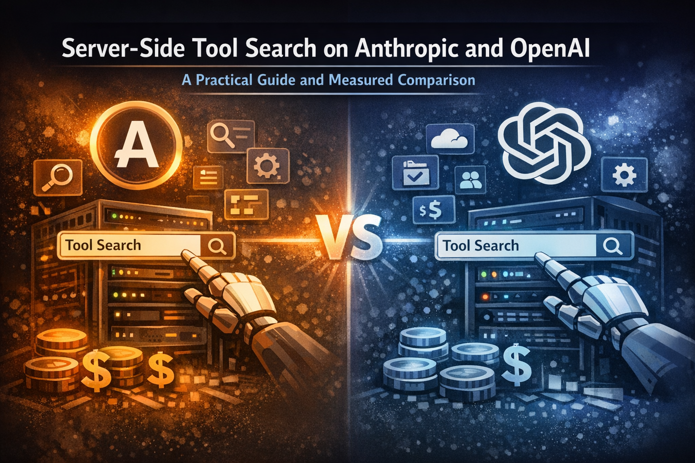

# tool-search-testing



Test harnesses for **server-side tool search** on Anthropic Claude and OpenAI gpt-5.4. Both providers shipped this feature in the last few weeks. Almost nobody is talking about it.

The harnesses run the same 21-tool catalog and the same agent task against each provider, capture every HTTP request and response, and report what tool search actually costs in tokens and dollars. A separate scale test fits a linear cost model across N inline tools to isolate per-tool marginal cost from per-request fixed overhead.

For the full analysis (methodology, provider-specific footguns, integration code, MCP server implications, recommendations), see [`WRITEUP.md`](./WRITEUP.md).

## Headline result

Same task, same 21 verbose tools, two-turn agent loop with one local tool execution. Cost per 1 million conversations at list pricing, **dry-run (no cache discount applied)** so the comparison is fair to Anthropic, which has no `cache_control` breakpoints set.

| Provider | Inline | Best deferred | Saving |
|---|---:|---:|---:|
| Anthropic Sonnet 4.6, BM25 | $25,407 | $17,916 | $7,491 (29%) |
| Anthropic Sonnet 4.6, regex | $25,407 | $18,261 | $7,146 (28%) |
| OpenAI gpt-5.4, namespace | $9,715 | **$6,490** | **$3,225 (33%)** |

Five things worth knowing before you ship this:

1. **OpenAI's per-tool cost is roughly half of Anthropic's** (51.4% on Responses, 52.7% on ChatCompletions, R² > 0.99 across N=0..20). Confirmed via the scale test linear fit; not noise. The writeup explains the three contributing factors (tokenizer, format wrapper, system-injected tool-use instructions).
2. **OpenAI's automatic prompt cache requires a 1,024-token prefix** to fire. Inline 21 tools (1,532 tokens) crosses it and gets ~92% cache hits. Namespace-deferred (475 static, 843 turn-1) **does not** and gets zero caching. In steady state with the cache discount applied, **inline becomes cheaper than namespace-deferred**, the opposite of the dry-run table above.
3. **On OpenAI, flat `defer_loading: true` on individual functions is a footgun.** It costs *more* than not deferring at all because OpenAI still ships compact stubs for every flagged function. You must wrap functions in a `namespace` for tool search to actually defer anything.
4. **On Anthropic, your message-history serializer must round-trip the `tool_search_tool_result` content block** every turn. If your agent loop only handles `text`, `tool_use`, and `tool_result`, the loaded tool definitions silently disappear and the model re-pays the search cost on every turn.
5. **ChatCompletions cannot use server-side tool search at all.** It is Responses-only on OpenAI. ChatCompletions per-tool cost is essentially identical to Responses (only an 81-token first-tool overhead difference) but the deferred-tool story does not apply: ChatCompletions users have to ship inline tools or build client-side filtering.

## Repository layout

```
python/
  anthropic/   Python harness for Anthropic, stdlib only (urllib)
  openai/      Python harness for OpenAI Responses API, stdlib only
  scale_test.py   Cross-provider scale test across N=0..20 inline tools
WRITEUP.md     full technical writeup
hero.png       repo banner
```

Each subdirectory is self-contained. The two `python/<provider>/` directories carry their own copy of the mock tool catalog so each is runnable in place.

## Running the harnesses

| Harness | Command | Required env |
|---|---|---|
| Anthropic | `cd python/anthropic && python3 anthropic_test.py` | `ANTHROPIC_API_KEY` |
| OpenAI Responses | `cd python/openai && python3 openai_test.py` | `OPENAI_API_KEY` |
| Cross-provider scale test | `cd python && python3 scale_test.py` | both keys |

The agent harnesses each produce a `flow.json` (or `flow_anthropic.json` / `flow_openai.json`) alongside the script with the full request and response bodies for every HTTP exchange, tagged by scenario. The flow files are gitignored. Inspect them with `jq` to see the actual `tool_search_call` arguments, the matched tool definitions injected mid-turn, and the per-turn token usage. The scale test prints results to stdout only.

## What each harness measures

The agent harnesses run two phases:

1. **Token counting**, to isolate the static cost of each configuration. Anthropic via `count_tokens` (a dedicated server-side endpoint that returns input token counts without invoking the model), OpenAI via a real `/v1/responses` call with `tool_choice: "none"` and `max_output_tokens: 16` and reading `usage.input_tokens` (OpenAI does not have a count_tokens endpoint).
2. **Live two-turn agent run**, where the model actually invokes a local tool, the harness returns a mock result, and the model produces a final answer. This is the only way to see the post-search cost (the cost of definitions that the search tool injects mid-turn).

Scenarios per harness:

- Prompt only (baseline)
- Prompt + 21 tools inline
- Prompt + 21 tools deferred (BM25 on Anthropic, namespace on OpenAI)
- Prompt + 21 tools deferred (regex on Anthropic, flat per-function on OpenAI)
- 3-tool variants of the above to expose the slope
- Two live agent runs (inline 21 vs deferred 21 best variant)

The scale test runs a third pass: hits all three API surfaces (Anthropic Messages, OpenAI Responses, OpenAI ChatCompletions) across N inline tools for N in {0, 1, 2, 5, 10, 15, 20}, then runs a least-squares linear fit `cost = fixed + per_tool * N` on each.

## Notes

- Models tested: `claude-sonnet-4-6`, `gpt-5.4-2026-03-05`.
- Anthropic beta header required: `advanced-tool-use-2025-11-20`.
- Anthropic supports two retrieval mechanisms: `tool_search_tool_bm25_20251119` and `tool_search_tool_regex_20251119`. Both have ~700-token static entry fees.
- OpenAI tool_search is gated to `gpt-5.4` and later, and is Responses-API only (not ChatCompletions).
- The OpenAI harness hits the REST endpoint directly because the published OpenAI SDKs had not been updated for `tool_search` when this was written.
- Token counts are server-side billing-truth (read from `usage.input_tokens`), not client-side estimates from a local tokenizer.
- Pricing references Anthropic and OpenAI list pricing as of April 2026. Cached input is billed at roughly 10% of normal on both providers, though this writeup uses dry-run uncached pricing for comparison fairness.

## License

MIT.
